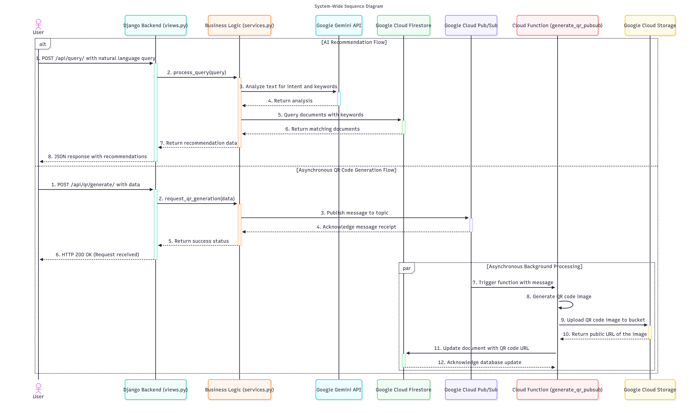

# 의성:Check
## Uiseong-gun Tourist Information and Recommendation Service 

This project is a tourism information and recommendation service for Uiseong-gun, Gyeongsangbuk-do, South Korea. It is built with a Python Django backend and leverages Google Cloud services to provide AI-powered recommendations and other features.

## Demo Video

[](https://www.youtube.com/watch?v=EjaPMB0wIrY)

[Watch the demo video on YouTube](https://www.youtube.com/watch?v=EjaPMB0wIrY)

## Key Features

*   **AI-Powered Recommendations:** Utilizes Google Gemini to analyze user queries in natural language and recommend tourist destinations from a Firestore database. The AI is given the persona of a "Uiseong-gun tourism expert."
*   **Asynchronous QR Code Generation:** An API endpoint triggers a Google Cloud Pub/Sub message to a Cloud Function (`generate_qr_pubsub`), which generates a QR code, saves it to Google Cloud Storage, and stores the public URL in Firestore.
*   **Data Management:** Includes various Python scripts to process and upload tourism data (`us_tourdata_final.txt`) into the Firestore database.

## Sequence Diagram



## Important Note on Local Execution

**This project will not work out-of-the-box after cloning.** It is deeply integrated with Google Cloud services and requires significant setup and configuration.

To run this project successfully, you must:

1.  **Have an active Google Cloud Platform (GCP) project.**
2.  **Enable the following APIs** in your GCP project:
    *   Google Cloud Firestore
    *   Google Cloud Storage
    *   Google Cloud Pub/Sub
    *   Vertex AI (for Gemini API access)
3.  **Create and configure a Service Account** with appropriate permissions (e.g., Firestore Read/Write, Storage Object Admin, Pub/Sub Publisher).
4.  **Set the `GOOGLE_APPLICATION_CREDENTIALS` environment variable** on your local machine to point to the JSON key file for your service account.
5.  **Deploy the `generate_qr_pubsub` Cloud Function** to your GCP project. The code for this function is not included in this repository and must be created separately.
6.  **Provide your own API keys** for services like Google Gemini.

Without completing these steps, the application will fail to connect to the necessary cloud resources, and core features like recommendations and QR code generation will not function.

## Tech Stack

*   **Backend:** Python (Django)
*   **Database:** Google Cloud Firestore
*   **AI:** Google Gemini
*   **Cloud Services:**
    *   Google Cloud Storage
    *   Google Cloud Pub/Sub
*   **Key Python Libraries:**
    *   `django`
    *   `google-cloud-firestore`
    *   `google-cloud-storage`
    *   `qrcode[pil]`

## Setup and Installation

1.  **Clone the repository:**
    ```bash
    git clone <repository-url>
    cd server-firestore
    ```

2.  **Create and activate a virtual environment:**
    ```bash
    python -m venv venv
    source venv/bin/activate  # On Windows, use `venv\Scripts\activate`
    ```

3.  **Install dependencies:**
    ```bash
    pip install -r uscheck_firestore/requirements.txt
    ```

4.  **Configure Google Cloud:**
    *   Make sure you have a Google Cloud project with Firestore, Cloud Storage, and Pub/Sub APIs enabled.
    *   Set up authentication by creating a service account, granting it necessary permissions, and setting the `GOOGLE_APPLICATION_CREDENTIALS` environment variable to point to your service account key file.

5.  **Run the Django application:**
    *   Navigate to the inner project directory:
        ```bash
        cd uscheck_firestore
        ```
    *   Apply database migrations (though not heavily used with Firestore as the primary DB):
        ```bash
        python manage.py migrate
        ```
    *   Start the development server:
        ```bash
        python manage.py runserver
        ```

## API Endpoints

*   `POST /api/query/`: The main endpoint for getting AI-based tourism recommendations.
    *   **Body:** `{ "query": "your question about Uiseong-gun" }`
*   `POST /api/qr/generate/`: Triggers the asynchronous generation of a QR code.
*   `GET /api/business/`: Fetches business information from Firestore.

## Data Management

The initial tourism data is located in `uscheck_firestore/us_tourdata_final.txt`.

The following scripts are used to prepare and upload the data to Google Cloud Firestore:
*   `load.py` / `upload_json_to_firestore.py`: Loads and uploads the data.
*   `add_prices.py`: Adds pricing information.
*   `convert_price_to_string.py`: Converts price fields to strings.
