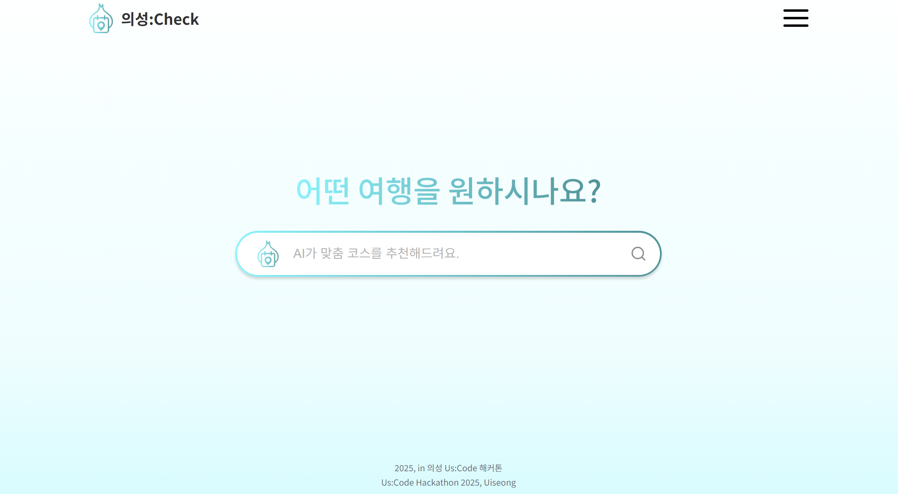

# 의성:Check
## Uiseong-gun Tourist Information and Recommendation Service 

This project is a tourism information and recommendation service for Uiseong-gun, Gyeongsangbuk-do, South Korea. It is built with a Python Django backend and leverages Google Cloud services to provide AI-powered recommendations and other features.

## Demo Video

<a href="https://www.youtube.com/watch?v=EjaPMB0wIrY" target="_blank">
  
</a>

[Watch the demo video on YouTube](https://www.youtube.com/watch?v=EjaPMB0wIrY)

## Key Features

*   **AI-Powered Recommendations:** Utilizes Google Gemini to analyze user queries in natural language and recommend tourist destinations from a Firestore database. The AI is given the persona of a "Uiseong-gun tourism expert."
*   **Asynchronous QR Code Generation:** An API endpoint triggers a Google Cloud Pub/Sub message to a Cloud Function (`generate_qr_pubsub`), which generates a QR code, saves it to Google Cloud Storage, and stores the public URL in Firestore.
*   **Data Management:** Includes various Python scripts to process and upload tourism data (`us_tourdata_final.txt`) into the Firestore database.

## Why Google Cloud Platform?

This project relies on a suite of Google Cloud services, each chosen for a specific, practical reason to create a robust and efficient application.

*   **Google Cloud Firestore:**
    *   **Reason:** The project's tourism data is structured in a JSON format. Firestore, being a NoSQL document database, is a natural fit as it stores data in a similar JSON-like structure. This eliminates the need for complex schemas and allows for flexible data that can easily evolve.

*   **Google Cloud Storage:**
    *   **Reason:** The application generates QR codes as image files. Cloud Storage is an **object storage** service, which is the ideal solution for storing and serving files like images, videos, or documents. It provides a highly scalable and cost-effective way to manage these assets and make them accessible via a public URL.

*   **Google Cloud Pub/Sub & Cloud Functions (A Powerful Combination):**
    *   **Reason:** These two services work together to create a highly efficient, asynchronous background processing system for QR code generation.
    *   **Pub/Sub** acts as a durable and reliable messaging queue. When a QR code is requested, the main Django application doesn't do the heavy lifting. It simply sends a small message to a Pub/Sub topic—a very fast operation—and can immediately tell the user "we're on it." This keeps the user-facing API responsive.
    *   **Cloud Functions** are event-driven and serverless. A function is set up to "listen" to the Pub/Sub topic. When a new message appears, the function automatically triggers, generates the QR code image, saves it to Cloud Storage, and updates Firestore. It only runs when there's work to do, making it extremely cost-effective compared to maintaining a server to handle these occasional tasks. This serverless, event-driven architecture is perfect for background tasks that you don't want to slow down your main application.

## Sequence Diagram


## Important Note on Local Execution

**This project will not work out-of-the-box after cloning.** It is deeply integrated with Google Cloud services and requires significant setup and configuration.

To run this project successfully, you must:

1.  **Have an active Google Cloud Platform (GCP) project.**
2.  **Enable the following APIs** in your GCP project:
    *   Google Cloud Firestore
    *   Google Cloud Storage
    *   Google Cloud Pub/Sub
    *   Vertex AI (for Gemini API access)
3.  **Create and configure a Service Account** with appropriate permissions (e.g., Firestore Read/Write, Storage Object Admin, Pub/Sub Publisher).
4.  **Set the `GOOGLE_APPLICATION_CREDENTIALS` environment variable** on your local machine to point to the JSON key file for your service account.
5.  **Deploy the `generate_qr_pubsub` Cloud Function** to your GCP project. The code for this function is not included in this repository and must be created separately.
6.  **Provide your own API keys** for services like Google Gemini.

Without completing these steps, the application will fail to connect to the necessary cloud resources, and core features like recommendations and QR code generation will not function.

## Tech Stack

*   **Backend:** Python (Django)
*   **Database:** Google Cloud Firestore
*   **AI:** Google Gemini
*   **Cloud Services:**
    *   Google Cloud Storage
    *   Google Cloud Pub/Sub
*   **Key Python Libraries:**
    *   `django`
    *   `google-cloud-firestore`
    *   `google-cloud-storage`
    *   `qrcode[pil]`

## Setup and Installation

1.  **Clone the repository:**
    ```bash
    git clone <repository-url>
    cd server-firestore
    ```

2.  **Create and activate a virtual environment:**
    ```bash
    python -m venv venv
    source venv/bin/activate  # On Windows, use `venv\Scripts\activate`
    ```

3.  **Install dependencies:**
    ```bash
    pip install -r uscheck_firestore/requirements.txt
    ```

4.  **Configure Google Cloud:**
    *   Make sure you have a Google Cloud project with Firestore, Cloud Storage, and Pub/Sub APIs enabled.
    *   Set up authentication by creating a service account, granting it necessary permissions, and setting the `GOOGLE_APPLICATION_CREDENTIALS` environment variable to point to your service account key file.

5.  **Run the Django application:**
    *   Navigate to the inner project directory:
        ```bash
        cd uscheck_firestore
        ```
    *   Apply database migrations (though not heavily used with Firestore as the primary DB):
        ```bash
        python manage.py migrate
        ```
    *   Start the development server:
        ```bash
        python manage.py runserver
        ```

## API Endpoints

*   `POST /api/query/`: The main endpoint for getting AI-based tourism recommendations.
    *   **Body:** `{ "query": "your question about Uiseong-gun" }`
*   `POST /api/qr/generate/`: Triggers the asynchronous generation of a QR code.
*   `GET /api/business/`: Fetches business information from Firestore.

## Data Management

The initial tourism data is located in `uscheck_firestore/us_tourdata_final.txt`.

The following scripts are used to prepare and upload the data to Google Cloud Firestore:
*   `load.py` / `upload_json_to_firestore.py`: Loads and uploads the data.
*   `add_prices.py`: Adds pricing information.
*   `convert_price_to_string.py`: Converts price fields to strings.

---

# 의성:Check (Korean)
## 의성군 관광 정보 및 추천 서비스

이 프로젝트는 대한민국 경상북도 의성군을 위한 관광 정보 및 추천 서비스입니다. Python Django 백엔드를 기반으로 구축되었으며, Google Cloud 서비스를 활용하여 AI 기반 추천 및 기타 기능을 제공합니다.

## 데모 영상

<a href="https://www.youtube.com/watch?v=EjaPMB0wIrY" target="_blank">
  
</a>

[YouTube에서 데모 영상 보기](https://www.youtube.com/watch?v=EjaPMB0wIrY)

## 주요 기능

*   **AI 기반 추천:** Google Gemini를 활용하여 사용자의 자연어 질의를 분석하고, Firestore 데이터베이스에서 관광지를 추천합니다. AI에는 '의성군 관광 전문가'라는 페르소나가 부여되었습니다.
*   **비동기 QR 코드 생성:** API 엔드포인트는 Google Cloud Pub/Sub 메시지를 트리거하여 Cloud Function(`generate_qr_pubsub`)을 호출합니다. 이 함수는 QR 코드를 생성하여 Google Cloud Storage에 저장하고, 공개 URL을 Firestore에 저장합니다.
*   **데이터 관리:** 다양한 Python 스크립트를 포함하여 `us_tourdata_final.txt`의 관광 데이터를 처리하고 Firestore 데이터베이스에 업로드합니다.

## Google Cloud Platform 사용 이유

이 프로젝트는 강력하고 효율적인 애플리케이션을 구축하기 위해 각각 특정하고 실용적인 이유로 선택된 Google Cloud 서비스 제품군에 의존합니다.

*   **Google Cloud Firestore:**
    *   **사용 이유:** 프로젝트의 관광 데이터는 JSON 형식으로 구성되어 있습니다. NoSQL 문서 데이터베이스인 Firestore는 유사한 JSON과 유사한 구조로 데이터를 저장하므로 자연스럽게 적합합니다. 이를 통해 복잡한 스키마가 필요 없으며 쉽게 발전할 수 있는 유연한 데이터를 사용할 수 있습니다.

*   **Google Cloud Storage:**
    *   **사용 이유:** 애플리케이션은 QR 코드를 이미지 파일로 생성합니다. Cloud Storage는 이미지, 비디오 또는 문서와 같은 파일을 저장하고 제공하는 데 이상적인 솔루션인 **객체 스토리지** 서비스입니다. 이러한 자산을 관리하고 공개 URL을 통해 액세스할 수 있도록 확장 가능하고 비용 효율적인 방법을 제공합니다.

*   **Google Cloud Pub/Sub 및 Cloud Functions (강력한 조합):**
    *   **사용 이유:** 이 두 서비스는 함께 작동하여 QR 코드 생성을 위한 매우 효율적인 비동기 백그라운드 처리 시스템을 만듭니다.
    *   **Pub/Sub**는 내구성 있고 신뢰할 수 있는 메시징 큐 역할을 합니다. QR 코드가 요청되면 기본 Django 애플리케이션은 힘든 작업을 수행하지 않습니다. 단순히 Pub/Sub 토픽에 작은 메시지를 보내는 매우 빠른 작업이며 즉시 사용자에게 "처리 중"이라고 알릴 수 있습니다. 이를 통해 사용자 대면 API의 응답성을 유지합니다.
    *   **Cloud Functions**는 이벤트 기반이며 서버리스입니다. 함수는 Pub/Sub 토픽을 "수신"하도록 설정됩니다. 새 메시지가 나타나면 함수가 자동으로 트리거되어 QR 코드 이미지를 생성하고 Cloud Storage에 저장한 다음 Firestore를 업데이트합니다. 작업이 있을 때만 실행되므로 이러한 간헐적인 작업을 처리하기 위해 서버를 유지하는 것에 비해 매우 비용 효율적입니다. 이 서버리스, 이벤트 기반 아키텍처는 기본 애플리케이션의 속도를 저하시키고 싶지 않은 백그라운드 작업에 적합합니다.

## 시퀀스 다이어그램


## 로컬 실행에 대한 중요 참고 사항

**이 프로젝트는 복제 후 바로 작동하지 않습니다.** Google Cloud 서비스와 긴밀하게 통합되어 있으며 상당한 설정 및 구성이 필요합니다.

이 프로젝트를 성공적으로 실행하려면 다음을 수행해야 합니다.

1.  **활성 Google Cloud Platform (GCP) 프로젝트가 있어야 합니다.**
2.  **GCP 프로젝트에서 다음 API를 활성화해야 합니다.**
    *   Google Cloud Firestore
    *   Google Cloud Storage
    *   Google Cloud Pub/Sub
    *   Vertex AI (Gemini API 액세스용)
3.  **적절한 권한(예: Firestore 읽기/쓰기, Storage 개체 관리자, Pub/Sub 게시자)으로 서비스 계정을 만들고 구성해야 합니다.**
4.  **로컬 컴퓨터에서 `GOOGLE_APPLICATION_CREDENTIALS` 환경 변수를 서비스 계정의 JSON 키 파일을 가리키도록 설정해야 합니다.**
5.  **`generate_qr_pubsub` Cloud Function을 GCP 프로젝트에 배포해야 합니다.** 이 함수에 대한 코드는 이 리포지토리에 포함되어 있지 않으며 별도로 생성해야 합니다.
6.  **Google Gemini와 같은 서비스에 대한 자체 API 키를 제공해야 합니다.**

이러한 단계를 완료하지 않으면 애플리케이션이 필요한 클라우드 리소스에 연결하지 못하고 추천 및 QR 코드 생성과 같은 핵심 기능이 작동하지 않습니다.

## 기술 스택

*   **백엔드:** Python (Django)
*   **데이터베이스:** Google Cloud Firestore
*   **AI:** Google Gemini
*   **클라우드 서비스:**
    *   Google Cloud Storage
    *   Google Cloud Pub/Sub
*   **주요 Python 라이브러리:**
    *   `django`
    *   `google-cloud-firestore`
    *   `google-cloud-storage`
    *   `qrcode[pil]`

## 설정 및 설치

1.  **리포지토리 복제:**
    ```bash
    git clone <repository-url>
    cd server-firestore
    ```

2.  **가상 환경 생성 및 활성화:**
    ```bash
    python -m venv venv
    source venv/bin/activate  # Windows에서는 `venv\Scripts\activate` 사용
    ```

3.  **종속성 설치:**
    ```bash
    pip install -r uscheck_firestore/requirements.txt
    ```

4.  **Google Cloud 구성:**
    *   Firestore, Cloud Storage 및 Pub/Sub API가 활성화된 Google Cloud 프로젝트가 있는지 확인합니다.
    *   서비스 계정을 만들고 필요한 권한을 부여하고 `GOOGLE_APPLICATION_CREDENTIALS` 환경 변수를 서비스 계정 키 파일을 가리키도록 설정하여 인증을 설정합니다.

5.  **Django 애플리케이션 실행:**
    *   내부 프로젝트 디렉터리로 이동합니다.
        ```bash
        cd uscheck_firestore
        ```
    *   데이터베이스 마이그레이션 적용(Firestore를 기본 DB로 사용하는 경우에는 많이 사용되지 않음):
        ```bash
        python manage.py migrate
        ```
    *   개발 서버 시작:
        ```bash
        python manage.py runserver
        ```

## API 엔드포인트

*   `POST /api/query/`: AI 기반 관광 추천을 받기 위한 기본 엔드포인트입니다.
    *   **본문:** `{ "query": "의성군에 대한 질문" }`
*   `POST /api/qr/generate/`: QR 코드의 비동기 생성을 트리거합니다.
*   `GET /api/business/`: Firestore에서 업체 정보를 가져옵니다.

## 데이터 관리

초기 관광 데이터는 `uscheck_firestore/us_tourdata_final.txt`에 있습니다.

다음 스크립트는 데이터를 준비하고 Google Cloud Firestore에 업로드하는 데 사용됩니다.
*   `load.py` / `upload_json_to_firestore.py`: 데이터를 로드하고 업로드합니다.
*   `add_prices.py`: 가격 정보를 추가합니다.
*   `convert_price_to_string.py`: 가격 필드를 문자열로 변환합니다.